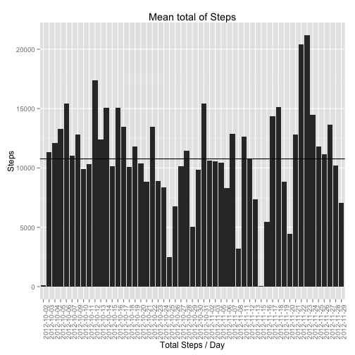
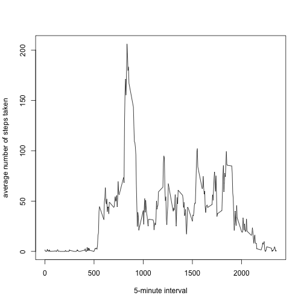
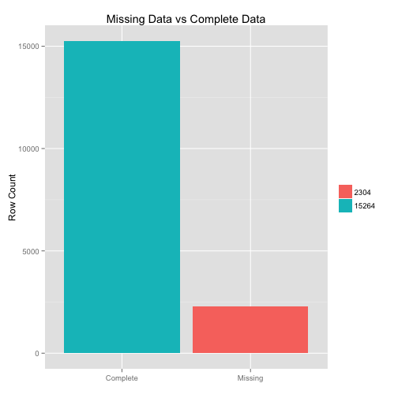
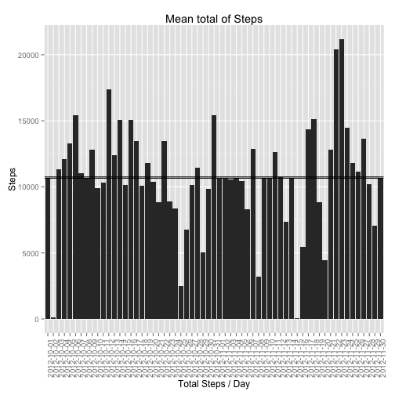
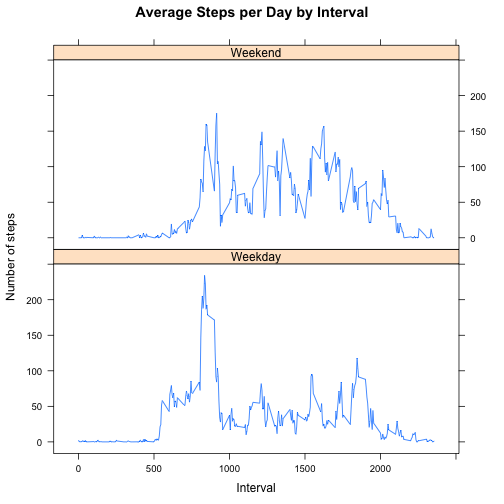

## Dependant Packages


```r
library(ggplot2)
library(data.table)
library(lattice)
```

## Loading and preprocessing the data

##### 1. Load the data (i.e. 𝚛𝚎𝚊𝚍.𝚌𝚜𝚟())


```r
if(!file.exists('activity.csv')){
    unzip('activity.zip')
}

alldata <- fread("activity.csv")
```

##### 2. Process/transform the data (if necessary) into a format suitable for your analysis


```r
activity <- alldata[!is.na(steps),]
```

## What is mean total number of steps taken per day?


```r
  aggActivity <- activity[,.(sumsteps = sum(steps)), by=date]
   
   p <- ggplot(data=aggActivity,aes(x=date, y=sumsteps))+
     labs(title = "Mean total of Steps", x = "Total Steps / Day", y = "Steps")+
     geom_bar(stat = "identity")+
     geom_hline(yintercept = mean(aggActivity$sumsteps))+
     geom_hline(yintercept = median(aggActivity$sumsteps))+
     theme(axis.text.x = element_text(angle = 90, hjust = 1))

   print(p)
```

 

# What is the average daily activity pattern?


```r
aggActivity <- activity[,.(avgsteps = mean(steps)), by=interval]
p2 <- plot(x=aggActivity$interval,y=aggActivity$avgsteps,type="l", xlab="5-minute interval", ylab="average number of steps taken")
```

 


## Imputing missing values

##### 1. Calculate and report the total number of missing values in the dataset (i.e. the total number of rows with 𝙽𝙰s)


```r
alldata[,imputing := is.na(steps)]
aggMissingData <- alldata[, count:=.N, by=imputing]
aggMissingData[imputing==TRUE,imputelab:= 'Missing']
aggMissingData[imputing==FALSE,imputelab:= 'Complete']

 p3 <- ggplot(dat=aggMissingData, aes(x=factor(imputelab),fill=factor(count)))+
       geom_bar()+
       labs(title = "Missing Data vs Complete Data", x = "", y = "Row Count")+
       guides(fill=guide_legend(title=NULL))

 print(p3)
```

 

##### 2. Devise a strategy for filling in all of the missing values in the dataset


```r
aggMissingData[imputing==TRUE,]$steps <- mean(aggMissingData[imputing==FALSE,]$steps)
```

##### 3. Create a new dataset that is equal to the original dataset but with the missing data filled in.


```r
aggActivity <- aggMissingData[,.(sumsteps = sum(steps)), by=date]
```

##### 4. Make a histogram of the total number of steps taken each day and Calculate and report the mean and median total number of steps taken per day


```r
p4 <- ggplot(data=aggActivity,aes(x=date, y=sumsteps))+
  labs(title = "Mean total of Steps", x = "Total Steps / Day", y = "Steps")+
  geom_bar(stat = "identity")+
  geom_hline(yintercept = mean(aggActivity$sumsteps))+
  geom_hline(yintercept = median(aggActivity$sumsteps))+
  theme(axis.text.x = element_text(angle = 90, hjust = 1))

  print(p4)
```

 


## Are there differences in activity patterns between weekdays and weekends?

##### 1. Create a new factor variable in the dataset with two levels – “weekday” and “weekend” indicating whether a given date is a weekday or weekend day.

```r
 weekdays <- c("Monday", "Tuesday", "Wednesday", "Thursday", "Friday")
 activity$dow <- as.factor(ifelse(is.element(weekdays(as.Date(activity$date)),weekdays), "Weekday", "Weekend"))
```

##### 2. Make a panel plot containing a time series plot (i.e. 𝚝𝚢𝚙𝚎 = "𝚕") of the 5-minute interval (x-axis) and the average number of steps taken, averaged across all weekday days or weekend days (y-axis)


```r
 stepsByInt <- aggregate(steps ~ interval + dow, activity, mean)
 xyplot(stepsByInt$steps ~ stepsByInt$interval|stepsByInt$dow, main="Average Steps per Day by Interval",xlab="Interval", ylab="Number of steps",layout=c(1,2), type="l")
```

 

